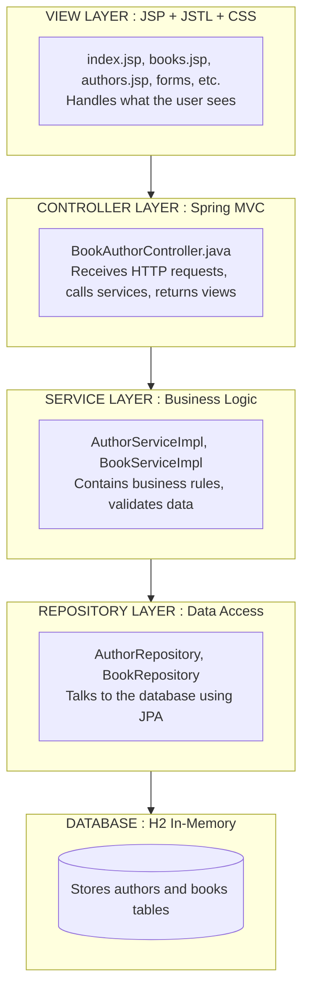
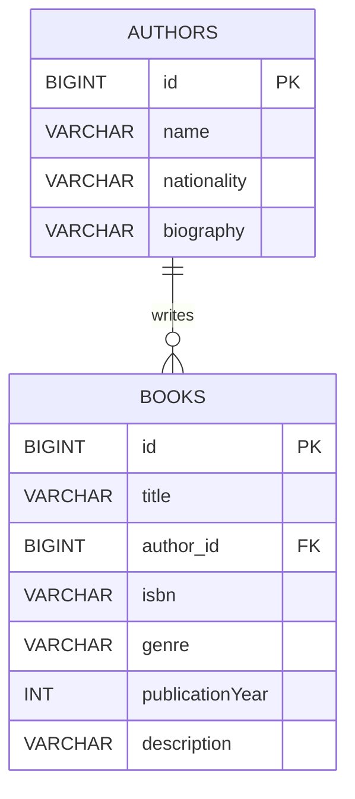

# Book & Author Management System

---

## Table of Contents

1. [What Is This?](#what-is-this)
2. [Prerequisites](#prerequisites)
3. [Project Structure](#project-structure)
4. [How to Run (Step by Step)](#how-to-run)
5. [Understanding the Architecture](#architecture)
6. [Features Implemented](#features)
7. [Testing the Application](#testing)
9. [Entity Relationship Diagram](#erd)
10. [Challenges & Solutions](#challenges)

---

## <a name="what-is-this">1. What Is This?</a>

This is a **Spring Boot web application** that manages two related entities:
- **Books** (e.g., Harry Potter, 1984)
- **Authors** (e.g., J.K. Rowling, George Orwell)

**Relationship:** One Author can write Many Books (One-to-Many).

The application allows you to:
- **Create** new books and authors via web forms
- **Read** (list) all books, all authors, and a combined view using an INNER JOIN query
- **Update** existing book and author details
- Handle errors gracefully (e.g., duplicate ISBNs)

**Tech Stack:**

- Spring Boot 3.2 (Java 17)
- Spring Data JPA (database access)
- Spring MVC (web layer)
- JSP + JSTL (views)
- H2 Database (in-memory, no setup needed)
- JUnit 5 + Mockito (testing)

---

## <a name="prerequisites">2. Prerequisites</a>

You need these installed on your computer:

| Software | Version | How to Check | Download Link |
|----------|---------|--------------|---------------|
| Java JDK | 17+ | Open terminal, type: `java -version` | [Oracle JDK](https://www.oracle.com/java/technologies/downloads/) or [OpenJDK](https://adoptium.net/) |
| Maven | 3.8+ | Type: `mvn -version` | [Maven](https://maven.apache.org/download.cgi) |
| IDE (optional) | Any | -- | [IntelliJ IDEA](https://www.jetbrains.com/idea/) (recommended) or [VS Code](https://code.visualstudio.com/) |
| Git (optional) | Any | Type: `git --version` | [Git](https://git-scm.com/downloads) |

---

## <a name="project-structure">3. Project Structure</a>

```
book-author-app/
├── pom.xml                          <-- Maven dependencies
├── src/
│   ├── main/
│   │   ├── java/com/example/bookauthor/
│   │   │   ├── BookAuthorApplication.java     <-- Main class (starts the app)
│   │   │   ├── controller/
│   │   │   │   └── BookAuthorController.java  <-- Handles HTTP requests
│   │   │   ├── dto/
│   │   │   │   └── BookAuthorDTO.java         <-- Data Transfer Object for JOIN query
│   │   │   ├── entity/
│   │   │   │   ├── Author.java              <-- Author entity (JPA)
│   │   │   │   └── Book.java                <-- Book entity (JPA)
│   │   │   ├── exception/
│   │   │   │   ├── GlobalExceptionHandler.java <-- Handles errors globally
│   │   │   │   └── ResourceNotFoundException.java <-- Custom exception
│   │   │   ├── repository/
│   │   │   │   ├── AuthorRepository.java    <-- Author database access
│   │   │   │   └── BookRepository.java      <-- Book database access + custom query
│   │   │   ├── service/
│   │   │   │   ├── AuthorService.java       <-- Author service interface
│   │   │   │   ├── BookService.java         <-- Book service interface
│   │   │   │   └── impl/
│   │   │   │       ├── AuthorServiceImpl.java   <-- Author service implementation
│   │   │   │       └── BookServiceImpl.java     <-- Book service implementation
│   │   ├── resources/
│   │   │   ├── application.properties         <-- Configuration (DB, JSP, etc.)
│   │   │   ├── data.sql                       <-- 10 sample authors + 10 sample books
│   │   │   └── static/css/
│   │   │       └── style.css                  <-- All CSS styling
│   │   └── webapp/WEB-INF/jsp/
│   │       ├── index.jsp                      <-- Dashboard/home page
│   │       ├── books.jsp                      <-- List all books
│   │       ├── authors.jsp                    <-- List all authors
│   │       ├── booksWithAuthors.jsp           <-- INNER JOIN result view
│   │       ├── addBook.jsp                    <-- Create book form
│   │       ├── addAuthor.jsp                  <-- Create author form
│   │       ├── editBook.jsp                   <-- Update book form
│   │       ├── editAuthor.jsp                 <-- Update author form
│   │       └── error.jsp                      <-- Error page
│   └── test/
│       └── java/com/example/bookauthor/
│           ├── service/
│           │   ├── AuthorServiceTest.java     <-- Mockito tests for AuthorService
│           │   └── BookServiceTest.java       <-- Mockito tests for BookService
│           └── repository/
│               └── BookRepositoryTest.java    <-- JPA tests for BookRepository
```

---

## <a name="how-to-run">4. How to Run ?</a>

### Method 1: Using Command Line

**Step 1:** Open your terminal/command prompt.

**Step 2:** Navigate to the project folder:

```bash
cd book-author-app
```

**Step 3:** Run the application using Maven:
```bash
mvn spring-boot:run
```

**Step 4:** Wait for the console to show:
```
Started BookAuthorApplication in X.XXX seconds
```

**Step 5:** Open your web browser and go to:
```
http://localhost:8080
```

**Step 6:** To stop the application, press `Ctrl + C` in the terminal.

---

### Method 2: Using an IDE (IntelliJ IDEA / Eclipse / VS Code)

**Step 1:** Open the project in your IDE.

**Step 2:** Wait for Maven to download dependencies (this may take a few minutes on first run).

**Step 3:** Find `BookAuthorApplication.java` in:
```
src/main/java/com/example/bookauthor/BookAuthorApplication.java
```

**Step 4:** Right-click the file and select **"Run"** or click the green play button.

**Step 5:** Open your browser to `http://localhost:8080`.

---

### Method 3: Build and Run JAR

**Step 1:** Build the project:
```bash
mvn clean package
```

**Step 2:** Run the generated JAR:
```bash
java -jar target/book-author-app-1.0.0.war
```

---

## <a name="architecture">5. Architecture</a>

This application follows the **Layered Architecture** pattern:



**Data Flow:**
1. User clicks a link in the browser
2. **Controller** receives the HTTP request
3. **Controller** calls the appropriate **Service** method
4. **Service** performs business logic and calls **Repository**
5. **Repository** executes SQL via JPA and returns data
6. **Service** returns data to **Controller**
7. **Controller** puts data in the **Model** and returns a view name
8. **JSP** renders the HTML using the model data
9. User sees the result in the browser

---

## <a name="features">6. Features Implemented</a>

### Entity Classes
- **Author** entity with `@Entity`, `@Id`, `@GeneratedValue`, `@OneToMany`, `@Column(unique = true)`
- **Book** entity with `@Entity`, `@Id`, `@GeneratedValue`, `@ManyToOne`, `@JoinColumn`, `@Column(unique = true)`
- Bidirectional relationship with cascade and orphan removal
- `addBook()` / `removeBook()` helper methods maintaining both sides
- Validation annotations (`@NotBlank`, `@Size`, `@Positive`, `@NotNull`)
- `equals()`, `hashCode()`, `toString()` overrides for proper JPA entity identity

### CRUD Operations

| Operation | Book | Author | How to Access |
|-----------|------|--------|---------------|
| **Create** | Add Book form | Add Author form | `/books/add` or `/authors/add` |
| **Read** | List all books | List all authors | `/books` or `/authors` |
| **Update** | Edit Book form | Edit Author form | `/books/edit/{id}` or `/authors/edit/{id}` |

**Custom INNER JOIN Query:**
- Accessible at: `/books-with-authors`
- Uses JPQL: `SELECT new BookAuthorDTO(...) FROM Book b INNER JOIN b.author a`
- Returns combined data from both tables in a single view

### Spring Boot Components
- **Repository Layer:** Interfaces extending `JpaRepository` with custom `@Query`
- **Service Layer:** Interfaces + implementations with `@Transactional`
- **Controller Layer:** `@Controller` with `@GetMapping` and `@PostMapping`
- **Exception Handling:** `@ControllerAdvice` with `GlobalExceptionHandler`
- **Data Binding:** `@ModelAttribute`, `@Valid`, `BindingResult`

### User Interface
- **9 JSP pages** with JSTL (`<c:forEach>`, `<c:if>`) and Expression Language (`${}`)
- **Modern CSS** with gradients, cards, responsive tables, hover effects
- **Intuitive navigation** with consistent header across all pages
- **Form validation** with error messages displayed inline

### Testing & Validation
- **BookServiceTest.java** - 8 test methods using Mockito
- **AuthorServiceTest.java** - 11 test methods using Mockito
- **BookRepositoryTest.java** - 6 integration tests using `@DataJpaTest`
- **AuthorRepositoryTest.java** - 4 integration tests using `@DataJpaTest`
- **GlobalExceptionHandlerTest.java** - 3 tests for exception handlers
- Pre-check validation for duplicate ISBN and author name

### Documentation
- This README.md file
- Inline JavaDoc comments in all classes
- Clean, well-organized code structure

---

## <a name="testing">7. Testing the Application</a>

### Running Unit Tests

**Step 1:** Open terminal in the project folder.

**Step 2:** Run all tests:
```bash
mvn test
```

**Expected output:**

```
Tests run: 32, Failures: 0, Errors: 0, Skipped: 0
BUILD SUCCESS
```

### Manual Testing via Web Interface

**Test 1: View Sample Data**
1. Go to `http://localhost:8080/books` - You should see 10 books
2. Go to `http://localhost:8080/authors` - You should see 10 authors
3. Go to `http://localhost:8080/books-with-authors` - You should see the INNER JOIN result

**Test 2: Create a New Book**
1. Go to `http://localhost:8080/books/add`
2. Fill in the form:
   - Title: "The Hobbit"
   - Genre: "Fantasy"
   - Publication Year: "1937"
   - ISBN: "978-0547928227"
   - Description: "A children's fantasy novel"
   - Author: Select "J.K. Rowling" (or any author)
3. Click "Save Book"
4. You should be redirected to `/books` with a success message

**Test 3: Create a New Author**
1. Go to `http://localhost:8080/authors/add`
2. Fill in the form:
   - Name: "J.R.R. Tolkien"
   - Nationality: "British"
   - Biography: "Father of modern fantasy literature"
3. Click "Save Author"
4. You should see the new author in the list

**Test 4: Update an Existing Record**
1. Go to `http://localhost:8080/books`
2. Click "Edit" on any book
3. Change the title to something else
4. Click "Update Book"
5. Verify the change in the book list

**Test 5: Test Exception Handling**
1. Go to `http://localhost:8080/books/add`
2. Try to add a book with ISBN: `978-0747532699` (already exists)
3. You should see an error page or error message

---

## <a name="erd">9. Entity Relationship Diagram</a>



**Relationships:**
- `Author` (1) ----< `Book` (N) — One Author can write Many Books
- Foreign Key: `books.author_id` → `authors.id` (NOT NULL)
- Unique Constraints: `authors.name`, `books.isbn`
- Cascade: `ALL` on `Author.books` with `orphanRemoval`

**Constraints:**
| Table | Column | Constraint |
|-------|--------|------------|
| `authors` | `id` | Primary Key, Auto Increment |
| `authors` | `name` | NOT NULL, UNIQUE, max 100 chars |
| `books` | `id` | Primary Key, Auto Increment |
| `books` | `title` | NOT NULL, max 200 chars |
| `books` | `isbn` | NOT NULL, UNIQUE, max 20 chars |
| `books` | `author_id` | Foreign Key → `authors.id`, NOT NULL |


---

## <a name="troubleshooting">11. Troubleshooting</a>

### Problem: "Port 8080 is already in use"
**Solution:** Change the port in `application.properties`:
```properties
server.port=8081
```
Then access `http://localhost:8081`

### Problem: "JSP file not found" or white label error
**Solution:** Make sure you have these dependencies in `pom.xml`:
```xml
<dependency>
    <groupId>org.apache.tomcat.embed</groupId>
    <artifactId>tomcat-embed-jasper</artifactId>
    <scope>provided</scope>
</dependency>
```

### Problem: "Tests fail with NullPointerException"
**Solution:** Make sure you're using Java 17+ and Maven 3.8+.
Run `mvn clean test` to force a fresh build.

### Problem: "Database tables not created"
**Solution:** Check `application.properties` has:

```properties
spring.jpa.hibernate.ddl-auto=create
spring.sql.init.mode=always
```

### Problem: "CSS not loading"
**Solution:** Make sure the CSS file is at:
```
src/main/resources/static/css/style.css
```
And the JSP references it correctly:
```jsp
<link rel="stylesheet" href="${pageContext.request.contextPath}/css/style.css">
```
