# Book & Author Management System - Project Documentation

Table of Contents

1. [Project Overview](#1-project-overview)
2. [Entity Relationship Design](#2-entity-relationship-design)
3. [Implementation Details](#3-implementation-details)
   - [3.1 Populate Database](#31-populate-database)
   - [3.2 Create Operation](#32-create-operation)
   - [3.3 Read Operation](#33-read-operation)
   - [3.4 Update Operation](#34-update-operation)
4. [Spring Boot Components Integration](#4-spring-boot-components-integration)
5. [User Interface](#5-user-interface)
6. [Testing & Validation](#6-testing--validation)
7. [Challenges Faced & Solutions](#7-challenges-faced--solutions)
9. [GitHub Repository](#9-github-repository)
10. [How to Run](#10-how-to-run)

## 1. Project Overview

This project is a **Spring Boot 3.2 web application** that manages two related entities: **Books** and **Authors**. It demonstrates full CRUD (Create, Read, Update) operations with a proper multi-layered architecture including Entity, Repository, Service, and Controller layers.

### Tech Stack

| Component | Technology |
|-----------|------------|
| Language | Java 17 |
| Framework | Spring Boot 3.2 |
| ORM | Spring Data JPA (Hibernate) |
| Web | Spring MVC |
| Views | JSP + JSTL |
| Database | H2 In-Memory Database |
| Testing | JUnit 5 + Mockito |
| Build Tool | Maven |

### Application Features

- **Create**: Add new books and authors via JSP forms with validation
- **Read**: Display all books, all authors, and a combined INNER JOIN view
- **Update**: Edit existing book and author details
- **Exception Handling**: Global exception handling for data integrity violations
- **Custom Query**: JPQL INNER JOIN query returning typed DTO
- **Database Population**: 10 sample authors and 10 sample books auto-loaded on startup

---

## 2. Entity Relationship Design

### 2.1 Entity Relationship Diagram 

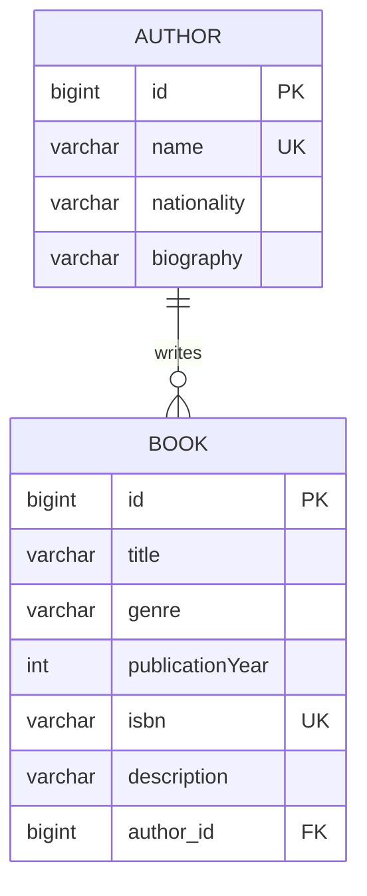

### 2.2 Class Diagram 

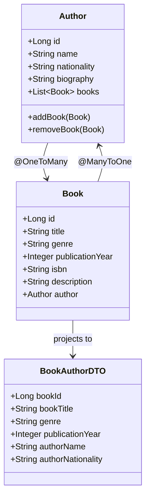

### 2.3 Entity Classes

#### Author Entity (`src/main/java/com/example/bookauthor/entity/Author.java`)

```java
@Entity
@Table(name = "authors")
public class Author {
    @Id
    @GeneratedValue(strategy = GenerationType.IDENTITY)
    private Long id;

    @NotBlank(message = "Name is required")
    @Size(min = 2, max = 100)
    @Column(nullable = false, unique = true)
    private String name;

    @Size(max = 100)
    private String nationality;

    @Size(max = 500)
    @Column(length = 500)
    private String biography;

    @OneToMany(mappedBy = "author", cascade = CascadeType.ALL, 
               orphanRemoval = true, fetch = FetchType.LAZY)
    private List<Book> books = new ArrayList<>();

    // Helper methods to maintain bidirectional consistency
    public void addBook(Book book) {
        books.add(book);
        book.setAuthor(this);
    }

    public void removeBook(Book book) {
        books.remove(book);
        book.setAuthor(null);
    }

    // Getters and setters, equals, hashCode, toString
}
```

#### Book Entity (`src/main/java/com/example/bookauthor/entity/Book.java`)

```java
@Entity
@Table(name = "books")
public class Book {
    @Id
    @GeneratedValue(strategy = GenerationType.IDENTITY)
    private Long id;

    @NotBlank(message = "Title is required")
    @Size(min = 1, max = 200)
    @Column(nullable = false, length = 200)
    private String title;

    @Size(max = 50)
    private String genre;

    @NotNull(message = "Publication year is required")
    @Positive(message = "Publication year must be positive")
    private Integer publicationYear;

    @NotBlank(message = "ISBN is required")
    @Size(max = 20)
    @Column(nullable = false, unique = true)
    private String isbn;

    @Column(length = 1000)
    private String description;

    @ManyToOne(fetch = FetchType.LAZY)
    @JoinColumn(name = "author_id", nullable = false)
    @NotNull(message = "Author is required")
    private Author author;

    // Getters and setters
}
```

### 2.4 Relationship Explanation 

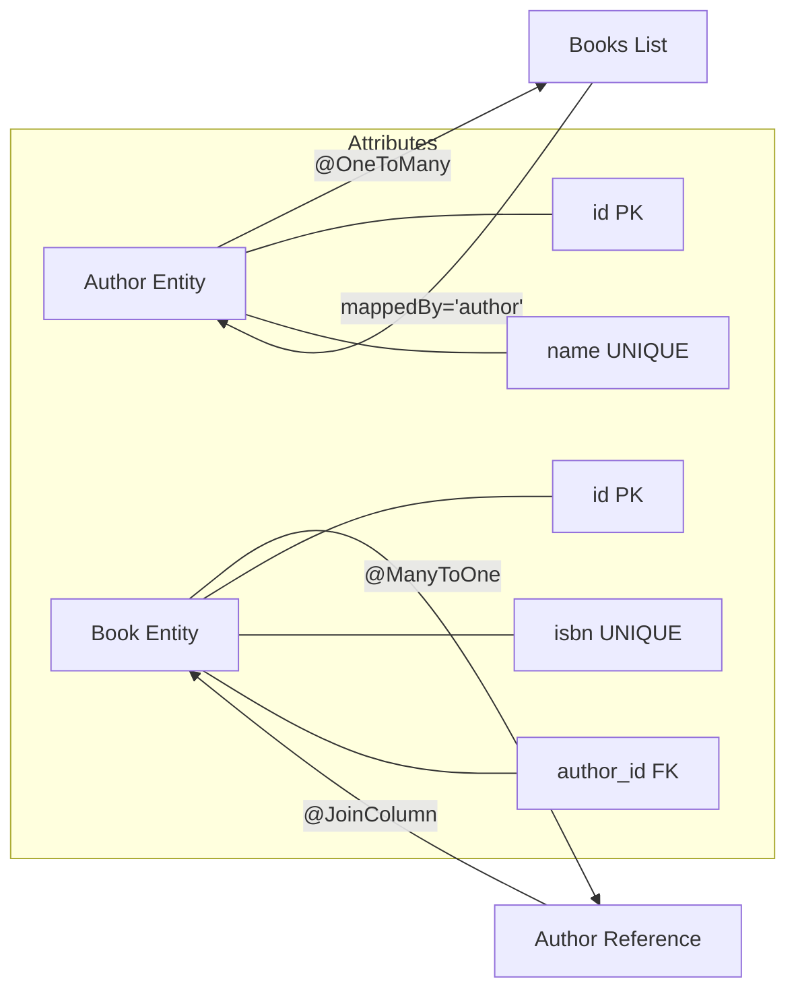

**Key Relationship Features:**
- **One-to-Many**: One Author can write multiple Books
- **Many-to-One**: Each Book belongs to one Author
- **CascadeType.ALL**: Operations on Author cascade to Books
- **orphanRemoval = true**: Removing a book from the list deletes it from DB
- **FetchType.LAZY**: Related entities are loaded on-demand for performance

---

## 3. Implementation Details

### 3.1 Populate Database

The database is populated using `data.sql` at `src/main/resources/data.sql`. Spring Boot automatically executes this on startup.

```sql
-- Insert 10 Authors
INSERT INTO authors (name, nationality, biography) VALUES
('J.K. Rowling', 'British', 'Author of the Harry Potter series...'),
('Stephen King', 'American', 'Master of horror fiction...'),
('Agatha Christie', 'British', 'Best-selling mystery novelist...'),
('George Orwell', 'British', 'Known for dystopian fiction...'),
('Jane Austen', 'British', 'Romantic fiction novelist...'),
('Ernest Hemingway', 'American', 'Nobel Prize-winning author...'),
('F. Scott Fitzgerald', 'American', 'Jazz Age novelist...'),
('Gabriel Garcia Marquez', 'Colombian', 'Nobel Prize-winning...'),
('Haruki Murakami', 'Japanese', 'Contemporary fiction writer...'),
('Toni Morrison', 'American', 'Nobel Prize-winning novelist...');

-- Insert 10 Books linked to authors
INSERT INTO books (title, genre, publication_year, isbn, description, author_id) VALUES
('Harry Potter and the Sorcerer''s Stone', 'Fantasy', 1997, '978-0747532699', '...', 1),
('The Shining', 'Horror', 1977, '978-0307743657', '...', 2),
('Murder on the Orient Express', 'Mystery', 1934, '978-0062693662', '...', 3),
('1984', 'Dystopian', 1949, '978-0451524935', '...', 4),
('Pride and Prejudice', 'Romance', 1813, '978-0141439518', '...', 5),
('The Old Man and the Sea', 'Fiction', 1952, '978-0684801223', '...', 6),
('The Great Gatsby', 'Fiction', 1925, '978-0743273565', '...', 7),
('One Hundred Years of Solitude', 'Magical Realism', 1967, '978-0060883287', '...', 8),
('Norwegian Wood', 'Fiction', 1987, '978-0099448822', '...', 9),
('Beloved', 'Historical Fiction', 1987, '978-1400033416', '...', 10);
```

---

### 3.2 Create Operation

#### Sequence Diagram

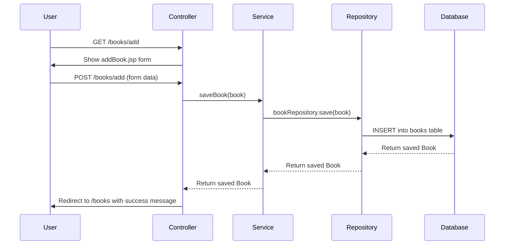

#### Controller Method (`BookAuthorController.java`)

```java
@PostMapping("/books/add")
public String addBook(@Valid @ModelAttribute("book") Book book,
                      BindingResult result,
                      Model model,
                      RedirectAttributes redirectAttributes) {
    if (result.hasErrors()) {
        model.addAttribute("authors", authorService.getAllAuthors());
        return "addBook";
    }
    bookService.saveBook(book);
    redirectAttributes.addFlashAttribute("successMessage", "Book added successfully!");
    return "redirect:/books";
}
```

#### Service Layer - Duplicate Detection (`BookServiceImpl.java`)

```java
@Override
public Book saveBook(Book book) {
    if (book.getIsbn() != null && bookRepository.existsByIsbn(book.getIsbn())) {
        throw new DataIntegrityViolationException(
            "Book with ISBN '" + book.getIsbn() + "' already exists");
    }
    return bookRepository.save(book);
}
```

#### JSP Form (`addBook.jsp`)

```jsp
<form action="/books/add" method="post" class="form">
    <div class="form-group">
        <label for="title">Title *</label>
        <input type="text" id="title" name="title" required>
    </div>
    <div class="form-group">
        <label for="genre">Genre</label>
        <input type="text" id="genre" name="genre">
    </div>
    <div class="form-group">
        <label for="publicationYear">Publication Year *</label>
        <input type="number" id="publicationYear" name="publicationYear" required>
    </div>
    <div class="form-group">
        <label for="isbn">ISBN * (Unique)</label>
        <input type="text" id="isbn" name="isbn" required>
    </div>
    <div class="form-group">
        <label for="description">Description</label>
        <textarea id="description" name="description" rows="4"></textarea>
    </div>
    <div class="form-group">
        <label for="author">Author *</label>
        <select id="author" name="author.id" required>
            <option value="">-- Select Author --</option>
            <c:forEach var="author" items="${authors}">
                <option value="${author.id}">${author.name}</option>
            </c:forEach>
        </select>
    </div>
    <div class="form-actions">
        <button type="submit" class="btn btn-primary">Add Book</button>
        <a href="/books" class="btn btn-secondary">Cancel</a>
    </div>
</form>
```

**Exception Handling:** Duplicate ISBN detection using `existsByIsbn()` method in repository.

---

### 3.3 Read Operation

#### Flow Diagram

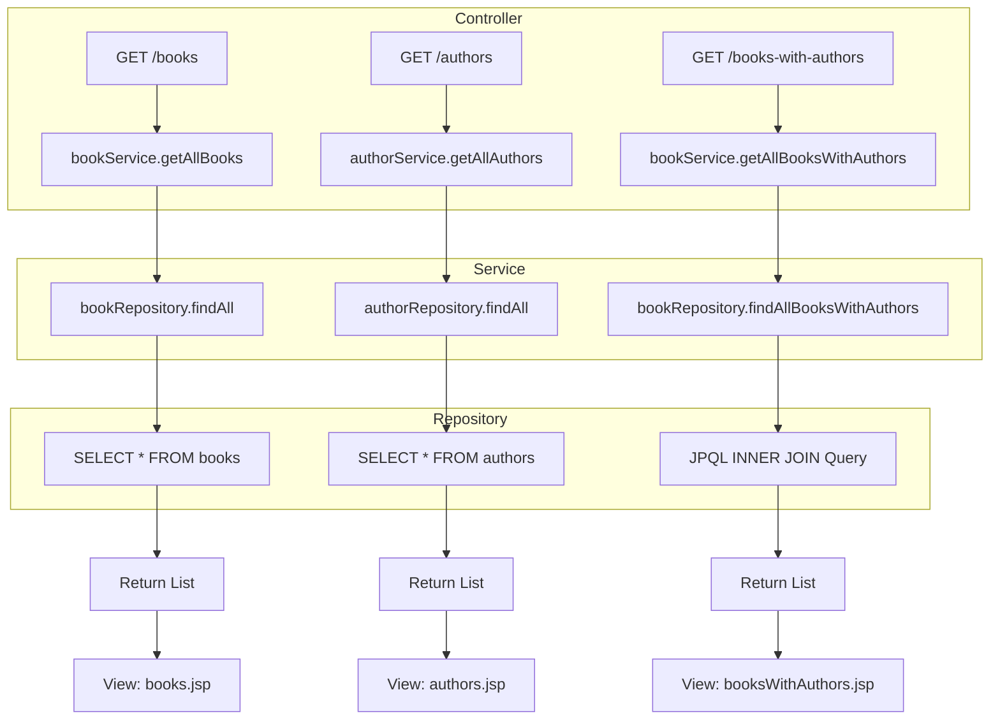

#### Custom INNER JOIN Query (`BookRepository.java`)

```java
public interface BookRepository extends JpaRepository<Book, Long> {
    
    @Query("SELECT new com.example.bookauthor.dto.BookAuthorDTO(" +
           "b.id, b.title, b.genre, b.publicationYear, a.name, a.nationality) " +
           "FROM Book b INNER JOIN b.author a")
    List<BookAuthorDTO> findAllBooksWithAuthors();
    
    boolean existsByIsbn(String isbn);
}
```

#### DTO for JOIN Result (`BookAuthorDTO.java`)

```java
public class BookAuthorDTO {
    private Long bookId;
    private String bookTitle;
    private String genre;
    private Integer publicationYear;
    private String authorName;
    private String authorNationality;

    public BookAuthorDTO(Long bookId, String bookTitle, String genre,
                         Integer publicationYear, String authorName, 
                         String authorNationality) {
        this.bookId = bookId;
        this.bookTitle = bookTitle;
        this.genre = genre;
        this.publicationYear = publicationYear;
        this.authorName = authorName;
        this.authorNationality = authorNationality;
    }
    // Getters and setters
}
```

#### JSP View for JOIN (`booksWithAuthors.jsp`)

```jsp
<table class="data-table">
    <thead>
        <tr>
            <th>Book Title</th>
            <th>Genre</th>
            <th>Year</th>
            <th>Author</th>
            <th>Nationality</th>
        </tr>
    </thead>
    <tbody>
        <c:forEach var="item" items="${bookAuthorList}">
            <tr>
                <td>${item.bookTitle}</td>
                <td><span class="badge">${item.genre}</span></td>
                <td>${item.publicationYear}</td>
                <td>${item.authorName}</td>
                <td>${item.authorNationality}</td>
            </tr>
        </c:forEach>
    </tbody>
</table>
```

---

### 3.4 Update Operation

#### Sequence Diagram 

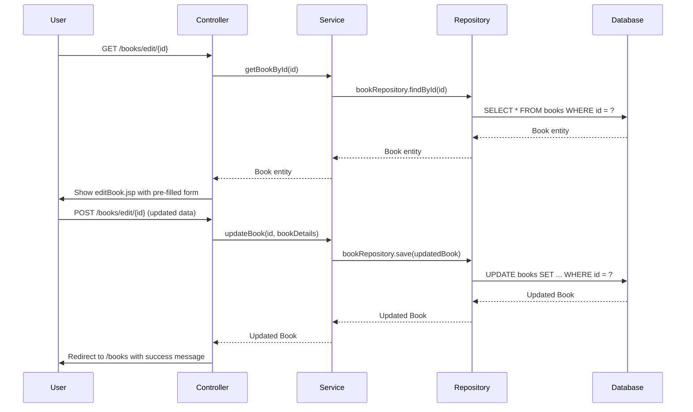

#### Controller Update Method

```java
@PostMapping("/books/edit/{id}")
public String updateBook(@PathVariable Long id,
                         @Valid @ModelAttribute("book") Book book,
                         BindingResult result,
                         Model model,
                         RedirectAttributes redirectAttributes) {
    if (result.hasErrors()) {
        model.addAttribute("authors", authorService.getAllAuthors());
        return "editBook";
    }
    bookService.updateBook(id, book);
    redirectAttributes.addFlashAttribute("successMessage", "Book updated successfully!");
    return "redirect:/books";
}
```

#### Service Update Implementation (`BookServiceImpl.java`)

```java
@Override
public Book updateBook(Long id, Book bookDetails) {
    Book book = getBookById(id);

    if (bookDetails.getIsbn() != null && !bookDetails.getIsbn().equals(book.getIsbn())) {
        if (bookRepository.existsByIsbn(bookDetails.getIsbn())) {
            throw new DataIntegrityViolationException("Book with ISBN already exists");
        }
    }

    book.setTitle(bookDetails.getTitle());
    book.setGenre(bookDetails.getGenre());
    book.setPublicationYear(bookDetails.getPublicationYear());
    book.setIsbn(bookDetails.getIsbn());
    book.setDescription(bookDetails.getDescription());
    book.setAuthor(bookDetails.getAuthor());

    return bookRepository.save(book);
}
```

---

## 4. Spring Boot Components Integration

### Architecture Diagram 

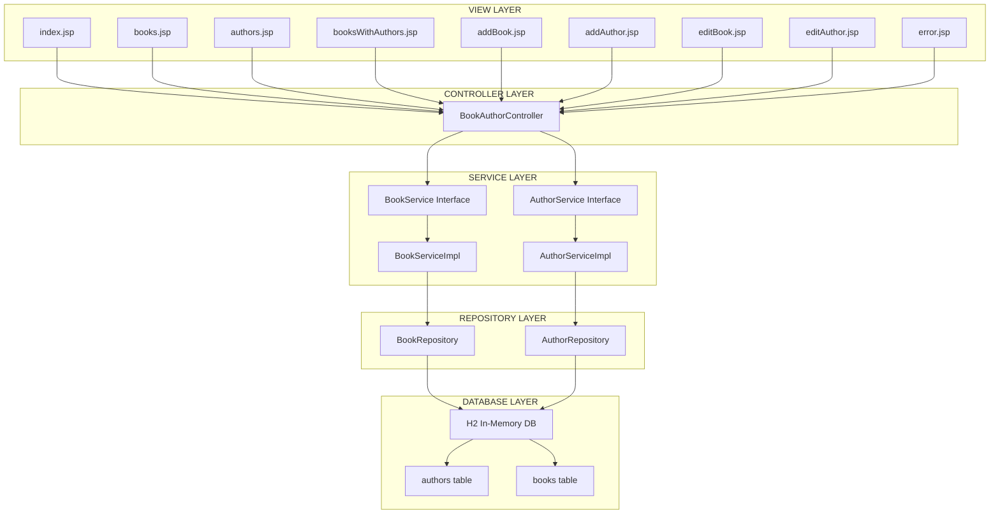

### Layer Responsibilities

| Layer | Responsibility | Annotations |
|-------|----------------|-------------|
| **View** | Display data, collect user input | JSP, JSTL, EL |
| **Controller** | Handle HTTP requests, coordinate views | `@Controller`, `@GetMapping`, `@PostMapping` |
| **Service** | Business logic, validation | `@Service`, `@Transactional` |
| **Repository** | Database operations | `@Repository`, extends `JpaRepository` |
| **Entity** | Data model, ORM mapping | `@Entity`, `@Id`, `@OneToMany`, `@ManyToOne` |

### Key Integration Points

```java
// Controller → Service: Constructor Injection
public BookAuthorController(BookService bookService, AuthorService authorService) {
    this.bookService = bookService;
    this.authorService = authorService;
}

// Service → Repository: Constructor Injection
public BookServiceImpl(BookRepository bookRepository) {
    this.bookRepository = bookRepository;
}

// Data Binding: @ModelAttribute + @Valid + BindingResult
@PostMapping("/books/add")
public String addBook(@Valid @ModelAttribute("book") Book book,
                      BindingResult result, Model model) { ... }
```

---

## 5. User Interface

### UI Pages Overview 

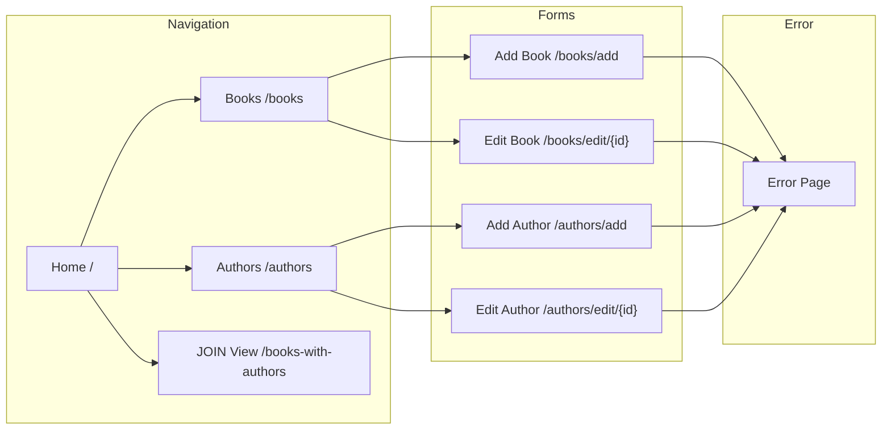

### Styling Features

The application uses a dedicated CSS file (`src/main/resources/static/css/style.css`) with:

- **Modern gradient background**: `linear-gradient(135deg, #667eea 0%, #764ba2 100%)`
- **Responsive card-based layout**
- **Styled tables with hover effects**
- **Form styling with focus states**
- **Alert messages (success/error)**
- **Badge components for genres**
- **Responsive design with media queries**

### Screenshots

1. **Home Page** (`http://localhost:8080/`) - Dashboard showing book and author counts

   

2. **Books List** (`http://localhost:8080/books`) - Table displaying all 10 books with edit button

   

3. **Authors List** (`http://localhost:8080/authors`) - Card-based layout showing all 10 authors

   

4. **Add Book Form** (`http://localhost:8080/books/add`) - Empty form

   

5. **Add Author Form** (`http://localhost:8080/authors/add`) - Empty form

   

6. **Edit Book Form** (`http://localhost:8080/books/edit/1`) - Pre-populated form

   

7. **Edit Author Form** (`http://localhost:8080/authors/edit/1`) - Pre-populated form

   

8. **Books with Authors (JOIN)** (`http://localhost:8080/books-with-authors`) - Combined table

   

9. **Error Page** - Trigger by adding duplicate ISBN

   

   

10. **H2 Console** (`http://localhost:8080/h2-console`) - Shows database tables

    

    

    

    

11. **Test Results** - Screenshot of `mvn test` output showing all tests passed

    

    

    

---

## 6. Testing & Validation

### Test Coverage Summary

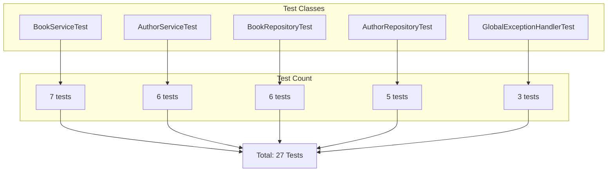

### Test Results Table

| Layer | Test File | Tests | Framework |
|-------|-----------|-------|-----------|
| Repository | `BookRepositoryTest.java` | 6 | JUnit 5 + @DataJpaTest |
| Repository | `AuthorRepositoryTest.java` | 5 | JUnit 5 + @DataJpaTest |
| Service | `BookServiceTest.java` | 7 | JUnit 5 + Mockito |
| Service | `AuthorServiceTest.java` | 6 | JUnit 5 + Mockito |
| Exception | `GlobalExceptionHandlerTest.java` | 3 | JUnit 5 + @WebMvcTest |

**Total: 27 unit tests**

### Sample Test Code (Repository Layer)

```java
@DataJpaTest
public class BookRepositoryTest {
    
    @Autowired
    private TestEntityManager entityManager;

    @Autowired
    private BookRepository bookRepository;

    @Test
    void testFindAllBooksWithAuthors() {
        Author author = new Author("John Doe", "American", "Bio");
        entityManager.persist(author);

        Book book = new Book("Test Book", "Fiction", 2023, "123", "Desc", author);
        entityManager.persist(book);
        entityManager.flush();

        List<BookAuthorDTO> result = bookRepository.findAllBooksWithAuthors();

        assertNotNull(result);
        assertFalse(result.isEmpty());
        assertEquals("Test Book", result.get(0).getBookTitle());
        assertEquals("John Doe", result.get(0).getAuthorName());
    }

    @Test
    void testExistsByIsbn() {
        assertTrue(bookRepository.existsByIsbn("999"));
        assertFalse(bookRepository.existsByIsbn("000"));
    }
}
```

### Sample Test Code (Service Layer)

```java
@ExtendWith(MockitoExtension.class)
public class BookServiceTest {

    @Mock
    private BookRepository bookRepository;

    @InjectMocks
    private BookServiceImpl bookService;

    @Test
    void testSaveBook_DuplicateIsbn() {
        Book testBook = new Book("Title", "Genre", 2023, "123-456", "Desc", new Author());
        when(bookRepository.existsByIsbn("123-456")).thenReturn(true);

        assertThrows(DataIntegrityViolationException.class, () -> {
            bookService.saveBook(testBook);
        });
        verify(bookRepository, never()).save(any());
    }

    @Test
    void testUpdateBook() {
        when(bookRepository.findById(1L)).thenReturn(Optional.of(testBook));
        when(bookRepository.save(any(Book.class))).thenReturn(testBook);

        Book updatedDetails = new Book();
        updatedDetails.setTitle("Updated Title");
        // ... set other fields

        Book updated = bookService.updateBook(1L, updatedDetails);

        assertNotNull(updated);
        verify(bookRepository, times(1)).save(any(Book.class));
    }
}
```

### Exception Handling Tests (`GlobalExceptionHandlerTest.java`)

```java
@WebMvcTest(BookAuthorController.class)
public class GlobalExceptionHandlerTest {

    @Test
    void testHandleResourceNotFound() {
        // Test that ResourceNotFoundException returns error view
    }

    @Test
    void testHandleDataIntegrityViolation() {
        // Test that duplicate ISBN shows error message
    }
}
```

---

## 7. Challenges Faced & Solutions

### Challenge 1: JPA Entity Relationship Configuration

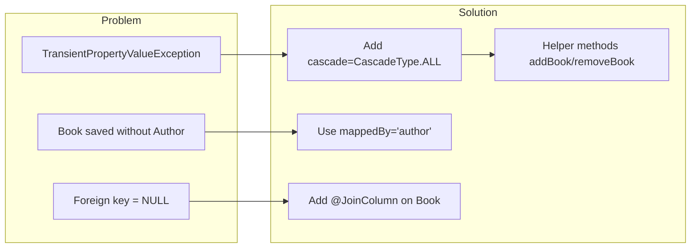

**Problem:** Initially struggled with configuring the bidirectional `@OneToMany` and `@ManyToOne` relationship correctly. The application threw `TransientPropertyValueException` when trying to save a Book without setting the Author first.

**Solution:**
- Added `cascade = CascadeType.ALL` and `orphanRemoval = true` on the `@OneToMany` side
- Used `mappedBy = "author"` to indicate Book is the owning side
- Added helper methods `addBook()` and `removeBook()` in Author entity for consistency
- Ensured `@JoinColumn(name = "author_id")` is on the Book entity (owning side)

### Challenge 2: Custom JPQL Query for INNER JOIN

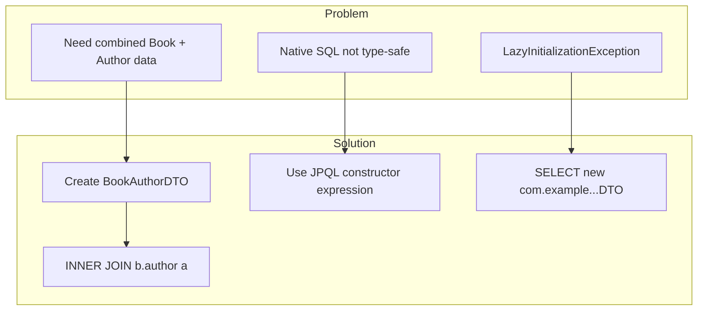

**Problem:** Needed to return combined data from both Book and Author tables using a custom query. Initially tried native SQL but needed a type-safe approach.

**Solution:**
- Created a DTO class (`BookAuthorDTO`) with a constructor matching the JPQL SELECT
- Used JPQL constructor expression: `SELECT new com.example.bookauthor.dto.BookAuthorDTO(...)`
- Used `INNER JOIN b.author a` to join Book with Author
- The DTO must have a constructor with matching parameter types

### Challenge 3: Form Validation and Error Handling

**Problem:** When form validation failed (e.g., empty title), the form would reload but lose the author dropdown list.

**Solution:**
- Added `BindingResult` parameter to controller methods
- When `result.hasErrors()`, re-add the authors list to the model
- Used `@Valid @ModelAttribute("book") Book book` for automatic validation
- Added `@NotNull`, `@NotBlank`, `@Size` annotations on entity fields

### Challenge 4: Handling Duplicate Data (ISBN/Name Uniqueness)

**Problem:** Users could add books with duplicate ISBN or authors with duplicate names, violating unique constraints.

**Solution:**
- Added `unique = true` constraint in `@Column` annotation
- Created custom query methods: `existsByIsbn()`, `existsByName()`
- In service layer, check for duplicates before saving/updating
- Throw `DataIntegrityViolationException` which is caught by `GlobalExceptionHandler`
- Display user-friendly error message on `error.jsp`

### Challenge 5: JSP Page Not Found (404 Error)

**Problem:** After setting up JSP pages, the application returned 404 errors when accessing URLs.

**Solution:**
- Added `spring.mvc.view.prefix=/WEB-INF/jsp/` and `spring.mvc.view.suffix=.jsp` in `application.properties`
- Ensured JSP files are placed in `src/main/webapp/WEB-INF/jsp/` directory
- Added `tomcat-embed-jasper` dependency in `pom.xml` for JSP compilation
- Added JSTL dependency for `<c:forEach>` and other tags

### Challenge 6: Data Population on Startup

**Problem:** Needed to populate the H2 database with sample data automatically on application startup.

**Solution:**
- Created `data.sql` file in `src/main/resources/`
- Spring Boot automatically executes `data.sql` on startup
- Used `spring.sql.init.mode=always` in `application.properties`
- Ensured author IDs in INSERT statements match the foreign key references

---

## 9. GitHub Repository

**Repository URL:** https://github.com/rehan-ahmed-cse/book-author-app	

---

## 10. How to Run

### Prerequisites
- Java 17+
- Maven 3.8+

### Steps

1. **Clone the repository:**
   ```bash
   git clone https://github.com/rehan-ahmed-cse/book-author-app.git
   cd book-author-app
   ```

2. **Build the project:**
   ```bash
   mvn clean install
   ```

3. **Run the application:**
   ```bash
   mvn spring-boot:run
   ```

4. **Access the application:**
   - Open browser and navigate to `http://localhost:8080`

5. **Run tests:**
   ```bash
   mvn test
   ```

6. **H2 Database Console:**
   - URL: `http://localhost:8080/h2-console`
   - JDBC URL: `jdbc:h2:mem:bookauthordb`
   - User: `sa`
   - Password: (leave empty)
